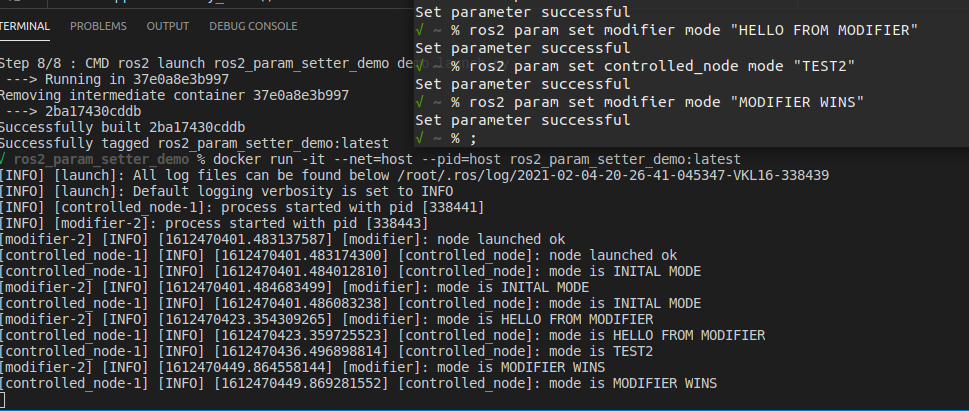

# ROS2 Set param of one node from another

This quick-n-dirty demo shows how to dynamically update parameters of one node from another node using the service nature of the parameters management.



The demo package provides 2 nodes:

- **controlled_node** - implements a node to be controlled via a parameter; it publishes the value of its `mode` parameter (string); The parameter may be changed dynamically.
- **modifier_node** - provides a string param `mode`; can be dynamically updated; when changed also modifies the mode of the "controlled_node"

Both nodes are launched via `demo.launch.py` that is also set to be the CMD of the container.

To build the demo:

```bash
docker build -t ros2_param_setter_demo .
```

To run the demo:

```bash
docker run -it --net=host --pid=host ros2_param_setter_demo:latest
```

To modify the parameter use `rqt` or simply:

```bash
ros2 param set modifier mode "HELLO WORLD"
```
